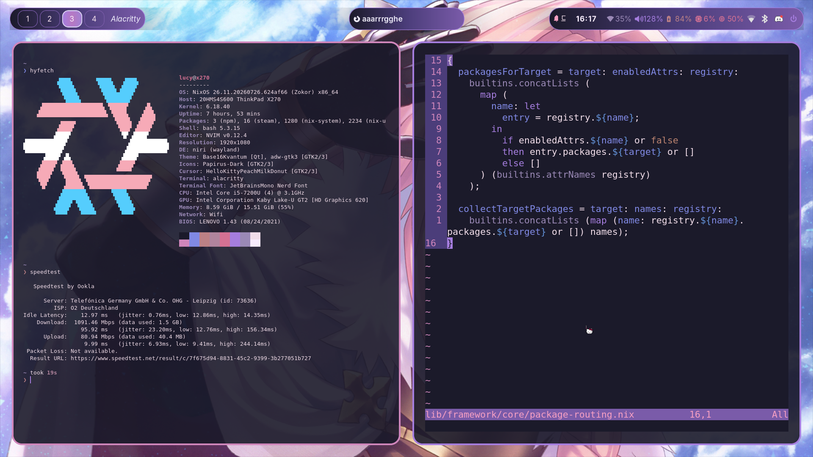

# 🐾 NixOS Homelab — `flakesonnix`

> 🐱 **Declarative NixOS infrastructure, fleet management, and way too much Nix. Meow.**

My personal NixOS infrastructure, built as a **data-driven, modular homelab framework**.

It manages my machines, networking, services, desktop configuration, secrets, deployments and more — all from one Nix flake.

And because apparently Nix wasn't complicated enough, this repository is also becoming the home of **Purr** 🐾 — my own declarative infrastructure language that compiles to Nix.

```text
        🐾 Purr
          │
          ▼
      🧠 Compiler
          │
          ▼
        Nix
          │
          ▼
       NixOS
          │
     ┌────┴────┐
     ▼         ▼
   💻 x270   🖥️ mireo
```

---

## 🐱 What is this?

This started as my NixOS dotfiles.

It grew.

Then it grew some more.

Now it is basically:

* 🏠 personal homelab
* 🧩 reusable NixOS/Home Manager framework
* 🖥️ multi-host configuration
* 🌐 network infrastructure
* 🔐 secret management
* 🚀 deployment tooling
* 📡 fleet management
* 🐾 Purr language/compiler

The infrastructure is **real and actually runs my machines**.

The framework is being designed so that reusable parts don't depend on my personal infrastructure.

---

# 💻 Hosts

| Host        | Role                    | Hardware                       | Notes                                         |
| ----------- | ----------------------- | ------------------------------ | --------------------------------------------- |
| 🐾 `x270`   | Desktop / gaming laptop | Lenovo ThinkPad X270, i7-7600U | Primary machine, Niri, eww, Secure Boot       |
| 🖥️ `mireo` | Home server / router    | Mini-PC, 4-port NIC            | NAT gateway, IPv6, NFS, iVentoy PXE, microvms |

### 🌐 Network

```text
10.8.0.0/24
fd00:cafe:1::1/64
```

The network is bridged on `mireo`.

See [`docs/hosts.md`](docs/hosts.md) for the full hardware and network documentation.



*🐾 ThinkPad X270 running Niri — Alt+Enter terminal, Alt+D fuzzel, Stylix cyberdeck theme.*

---

# 🧩 Data-Driven Configuration

Instead of copy-pasting configuration between hosts, the framework builds machines from structured data.

```text
data/
 │
 ├── 🎭 roles/
 ├── 📦 bundles/
 ├── 🎮 presets/
 ├── 📚 packages/
 ├── 🖥️ hosts/
 └── 🏠 home/
       │
       ▼
  lib/framework
       │
       ▼
 ┌───────────────┐
 │ NixOS modules │
 │ Home modules  │
 │ Packages      │
 │ Host config   │
 └───────────────┘
```

## 🎭 Roles

Roles describe **what something is supposed to do**.

Current examples:

```text
core
desktop
dev
gaming
llm
```

A role can define:

* required roles
* conflicting roles
* target type
* module flags
* package tags
* presets
* bundles

So instead of repeating a giant configuration everywhere:

```text
host → gaming
host → dev
host → desktop
```

the framework resolves the actual configuration.

Meow-powered dependency management. 🐱

---

## 📦 Bundles

Bundles are Home Manager configuration groups.

Current bundles include:

```text
core
desktop
dev
```

They provide reusable chunks of user configuration without turning every host into a giant pile of options.

---

## 🎮 Presets

Presets group host-level configuration.

Current examples:

```text
gaming-base
gaming-performance
gaming-steam
```

Presets make it possible to compose larger configurations without duplicating every individual module option.

---

## 📚 Package Registries

Packages are organised through tagged registries:

```text
data/packages/system.nix
data/packages/home.nix
```

Roles reference package tags and the framework resolves the final package set.

---

# 🧱 Repository Layout

```text
.
├── 🧊 flake.nix
├── ⚙️ nix-settings.nix
│
├── 📁 profiles/
│   ├── base.nix
│   └── desktop.nix
│
├── 📁 data/
│   ├── 🎭 roles/
│   ├── 📦 bundles/
│   ├── 🎮 presets/
│   ├── 📚 packages/
│   ├── 🖥️ hosts/
│   └── 🏠 home/
│
├── 📁 modules/
│   ├── 🐧 nixos/
│   └── 🏠 home/
│
├── 📁 hosts/
│   ├── 💻 x270/
│   └── 🖥️ mireo/
│
├── 📁 home/
│   └── 🐾 lucy/
│
├── 🔑 keys/
├── 🧠 lib/
├── 🚀 nixfleet/
├── 🐾 purr/
├── 🧪 tests/
├── 📚 docs/
│
└── 🔐 .sops.yaml
```

---

# 🛠️ Common Commands

A `justfile` provides friendly commands.

Run:

```bash
just
```

to see everything.

Or summon the interactive menu:

```bash
just menu
```

### 🐾 Everyday commands

```bash
just                 # 📋 list recipes
just menu             # 🐱 interactive fzf launcher
just rebuild          # 🔄 rebuild local x270
just deploy-x270      # 🚀 deploy x270
just deploy-mireo     # 🚀 deploy mireo
just deploy-all       # 🚀 deploy everything
just check-light      # 🧪 fast checks
just update           # ⬆️ update flake inputs
just fmt              # ✨ format Nix
just lint             # 🔎 run statix
```

Raw flake commands work too:

```bash
nix run .#rebuild
nix run .#deploy-x270
nix run .#deploy-mireo
nix run .#menu

nix run .#check-light
nix run .#check-full

nix run .#update

nixos-rebuild switch --flake .#x270
```

Because sometimes you just want to speak directly to the Nix gods. 🙏🐈

---

# 🐾 NixFleet

**NixFleet** is the homelab's in-repo runtime control plane.

The idea:

```text
Nix
 │
 ▼
📜 manifest.nix
 │
 ▼
📄 manifest.json / ui.json
 │
 ▼
🐹 Go API + Agent
 │
 ▼
⚛️ React UI
```

The goal is to combine **Nix-first declarative infrastructure** with useful runtime visibility.

## 🚀 M1

M1 provides the first real vertical slice.

### 🖥️ Hosts

```text
GET /api/v1/hosts
GET /api/v1/hosts/:host/health
GET /api/v1/hosts/:host/resources
GET /api/v1/hosts/:host/network
GET /api/v1/hosts/:host/vms
GET /api/v1/hosts/:host/systemd/failed
```

The API gets host information from the Nix-generated manifest rather than hardcoding the infrastructure.

### 📊 Runtime information

The agent collects things such as:

* CPU usage
* load
* memory
* storage
* network interfaces
* routes
* VM state
* systemd failures
* kernel
* OS
* uptime

No external monitoring dependency is required for these basics.

### 🖥️ Web UI

The current UI provides:

* 🏠 host overview
* 🖥️ VM table
* 🌐 network information
* ⚙️ failed systemd units
* 💚 health state
* 📊 resource information

Operations such as deployment and terminal access come later.

**Observability first. Operations second.** 🐾

See [`nixfleet/docs/architecture.md`](nixfleet/docs/architecture.md).

---

# 🔐 Secrets

Secrets are managed using:

* 🔒 sops-nix
* 🔑 age
* 🧩 declarative secret configuration

See [`docs/secrets.md`](docs/secrets.md).

Quick setup:

```bash
nix run .#setup-sops x270

SOPS_AGE_KEY_FILE=.sops/keys.txt \
  sops hosts/x270/secrets.yaml
```

The goal is simple:

> 🔐 Secrets should not accidentally become Nix store contents.

---

# 🌐 Networking

`mireo` acts as the central network machine.

Current infrastructure includes:

* 🌐 IPv4 networking
* 🌍 IPv6
* 🔀 NAT
* 🌉 bridging
* 📡 PXE/iVentoy
* 📂 NFS
* 🖥️ microVM networking

The network configuration is declarative and generated from the same repository as the rest of the infrastructure.

Future work also includes stronger management separation using:

* 🔐 SOPS
* 🐝 Tailscale
* 🔑 trusted SSH interfaces
* 🧱 interface-aware firewall rules

---

# 🐾 Purr

And then there is **Purr**.

Because apparently writing Nix wasn't enough.

Purr is a new declarative systems/infrastructure language that compiles to Nix.

It is being implemented in **Zig**.

```text
.purr
  │
  ▼
🐾 Lexer
  │
  ▼
🌳 Parser / AST
  │
  ▼
🧠 Semantic validation
  │
  ▼
📦 Nix code generation
  │
  ▼
❄️ Nix
```

Purr is intended to make concepts such as:

```text
host
service
network
role
package
secret
certificate
deployment
```

easier to express directly.

The important part:

**Purr is not supposed to be just Nix with different punctuation.**

The language should have its own concepts, validation and developer experience.

And yes:

```text
meow
nya
🐾
```

are allowed to be actual language concepts. 😼

### 🦀 Why Zig?

The compiler is written in **Zig** deliberately.

The goal is to learn and use a different systems programming language rather than automatically reaching for something already familiar.

Purr itself remains independent from Zig.

---

# 🧪 CI

GitHub Actions run checks on pushes and pull requests.

| Job           | 🐾 Purpose                            |
| ------------- | ------------------------------------- |
| `check-light` | ⚡ Fast evaluation checks              |
| `check-full`  | 🧪 Full framework + deployment checks |
| `eval`        | ❄️ NixOS evaluation                   |
| `topology`    | 🌐 Regenerate topology                |

The goal is to catch broken infrastructure **before deploying it to an actual machine**.

---

# 🌐 Network Topology

Topology diagrams are generated using `nix-topology`.

```bash
nix build .#topology
```

Generated diagrams:

| Diagram          | 🗺️                                            |
| ---------------- | ---------------------------------------------- |
| Hosts & services |        |
| Network layout   |  |

The topology is generated from the infrastructure configuration instead of being maintained manually.

Less drawing.

More Nix.

🐱

---

# 🧰 Development

Enter the reproducible development environment:

```bash
nix develop
```

Available tools include:

```text
✨ alejandra
🔎 statix
🌳 nix-tree
```

Format:

```bash
nix fmt
```

Lint:

```bash
statix check
```

---

# 📚 Documentation

The documentation is split into focused areas:

* 🖥️ [`docs/hosts.md`](docs/hosts.md) — hardware, hosts, roles and networking
* 🧩 [`docs/data-model.md`](docs/data-model.md) — roles, bundles, presets and packages
* 🧱 [`docs/modules.md`](docs/modules.md) — NixOS/Home Manager modules
* 🔐 [`docs/secrets.md`](docs/secrets.md) — sops-nix and age
* 🎮 [`docs/gaming-x270.md`](docs/gaming-x270.md) — x270 gaming setup
* 🖨️ [`docs/printing.md`](docs/printing.md) — printer setup
* 🐾 [`nixfleet/docs/architecture.md`](nixfleet/docs/architecture.md) — NixFleet architecture

---

# 🐱 Design Philosophy

### ❄️ Nix everything

If it can reasonably be declared, it should be declared.

### 🧩 Compose, don't copy

Common configuration belongs in reusable modules, roles, bundles and presets.

### 🔐 Secure by default

Secrets and management access should have explicit security boundaries.

### 🧠 Make abstractions understandable

An abstraction isn't useful if you need to understand three other abstractions to use it.

### 🧪 Test before deployment

Broken configuration should fail in CI rather than on the actual machine.

### 🐾 Keep it weird

Infrastructure can be serious without being boring.

### 😼 Meow

This is still a personal project.

It is allowed to have personality.

---

# 🚧 Status

This repository is **actively evolving**.

The NixOS infrastructure is real and running.

The framework is being cleaned up and made increasingly reusable.

NixFleet is under active development.

Purr is experimental and very much a work in progress.

Expect:

```text
🧪 experiments
🔨 refactors
🐛 bugs
✨ new features
💥 occasional breaking changes
🐱 excessive meowing
```

If something looks unnecessarily complicated:

**it probably means I haven't refactored it yet.**

---

# 🐾 Why?

Because apparently:

> "I'll just make some NixOS dotfiles"

was a lie.

It became a homelab.

Then a framework.

Then a fleet manager.

And now I'm writing a programming language.

**meow.** 🐱💻❄️
