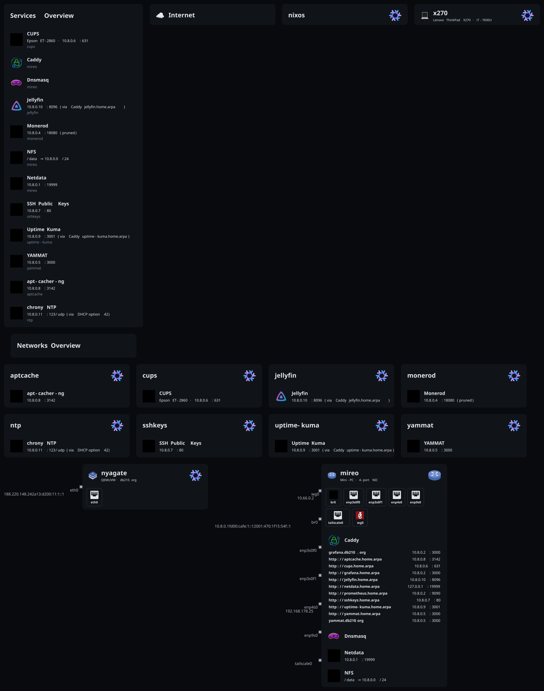
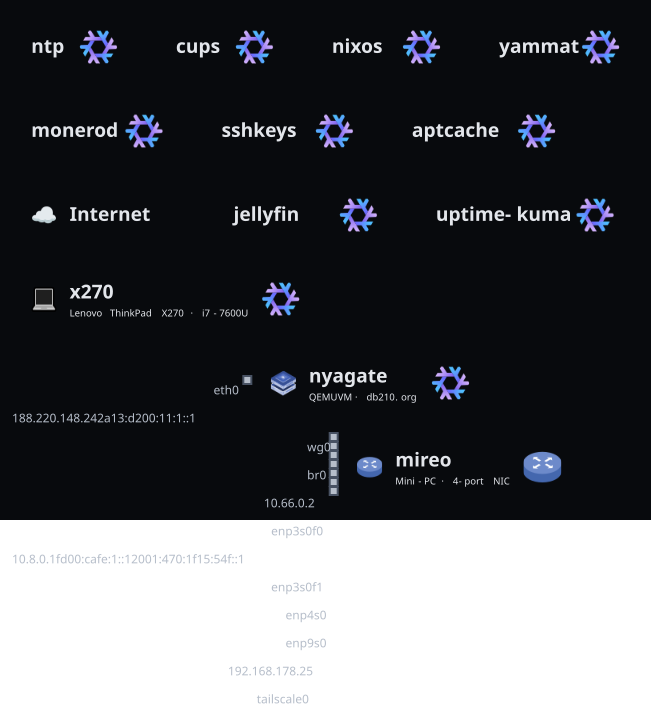

# NixOS Dotfiles

NixOS flake managing two machines for user `lucy`. Data-driven host and home composition via the in-repo framework (`lib/framework`, `frameworkLib`).

## Hosts

| Host | Role | Hardware | Notes |
|------|------|----------|-------|
| `x270` | Desktop / gaming laptop | Lenovo ThinkPad X270, i7-7600U | Primary machine. Niri compositor, eww bar, Secure Boot |
| `mireo` | Home server / router | Mini-PC, 4-port NIC | NAT gateway, IPv6 (FritzBox PD), NFS, iVentoy PXE, microvms |

Network: `10.8.0.0/24` (+ `fd00:cafe:1::1/64` ULA) bridged on mireo. See [docs/hosts.md](docs/hosts.md) for full details.

## Layout

```
.
├── flake.nix               # Flake inputs, host configs, deploy nodes, apps
├── nix-settings.nix        # Global nix daemon settings (substituters, caches)
├── profiles/
│   ├── base.nix            # Shared NixOS base (imported by all hosts)
│   └── desktop.nix         # Desktop additions on top of base
├── data/
│   ├── roles/              # Role definitions (desktop, dev, gaming, llm, core)
│   ├── bundles/            # Home Manager bundle definitions (core, desktop, dev)
│   ├── presets/            # Host preset definitions (gaming-base, -performance, -steam)
│   ├── packages/
│   │   ├── system.nix      # Tagged system package registry
│   │   └── home.nix        # Tagged home package registry
│   ├── hosts/<host>/       # Per-host settings, roles, module flags
│   └── home/lucy/          # Per-user bundles, roles, settings
├── modules/
│   ├── nixos/              # Reusable NixOS modules
│   └── home/               # Reusable Home Manager modules
├── hosts/
│   ├── x270/               # Hardware config + framework host.nix
│   └── mireo/              # + microvm definitions (7 VMs: grafana, monerod, network-services, yammat, cups, sshkeys, aptcache)
├── home/lucy/              # User composition entry point
├── keys/                   # SSH public keys
├── lib/                    # Shared Nix functions
└── .sops.yaml              # sops encryption rules
```

## Common Commands

A `justfile` provides friendly, discoverable recipes — run `just` to list them,
or `just menu` for an interactive fzf launcher that runs any flake app.

```bash
just                 # list all recipes
just menu            # interactive command picker
just rebuild         # rebuild local x270 (via nh)
just deploy-x270     # deploy x270 via deploy-rs (localhost)
just deploy-mireo    # deploy mireo via deploy-rs (10.8.0.1)
just deploy-all      # deploy both hosts via deploy-rs
just check-light     # fast eval-surface checks
just update          # update flake inputs
just fmt             # format with alejandra
just lint            # lint with statix
```

Equivalent raw flake commands still work:

```bash
# Rebuild (local, via nh)
nix run .#rebuild

# Deploy via deploy-rs
nix run .#deploy-x270   # x270 to localhost
nix run .#deploy-mireo  # mireo to 10.8.0.1

# Interactive launcher
nix run .#menu

# CI checks
nix run .#check-light   # Fast: eval surfaces only
nix run .#check-full    # Full: build all CI checks

# Update inputs
nix run .#update

# Direct nixos-rebuild
nixos-rebuild switch --flake .#x270
```

Shell aliases available on x270: `rebuild`, `nix-rebuild`, `nix-clean`, `nix-update`.

## Data Model

Configuration is declared in `data/` and applied by the framework. See [docs/data-model.md](docs/data-model.md).

**Roles** (`data/roles/`) declare what a host or home should activate. Each role lists required/conflicting roles, target types, and maps to module flags, package tags, presets, or bundles.

**Bundles** (`data/bundles/`) declare Home Manager program toggles and settings for a slice of the home config.

**Presets** (`data/presets/`) declare sets of module flag values applied at the host level.

**Package registries** (`data/packages/`) are attr sets of tagged packages. Roles reference tags; the framework resolves which packages end up in the system.

## Modules

All custom NixOS and Home Manager modules live in `modules/`. See [docs/modules.md](docs/modules.md) for options reference.

Key modules:
- `nixos/base.nix` — `lucy.base.*`: SSH, timezone, locale, sudo, firewall, libvirtd
- `nixos/asterisk.nix` — `services.asteriskLocal.*`: Local SIP PBX
- `nixos/niri.nix` — `niri.users`: Niri + greetd/tuigreet host integration
- `nixos/gaming.nix` — aggregate: Steam, GameMode, Gamescope, performance tuning
- `home/niri.nix` — `programs.niri.enable`: Full KDL config, lock screen, wlogout
- `home/waybar.nix` — `programs.waybar.enable`: Styled bar with mpris, battery, CPU

## NixFleet — Mireo Runtime Control Plane (M1)

`nixfleet` is the in-repo control plane for the homelab. Architecture is **Nix → `nixfleet/manifest.nix` → `manifest.json`/`ui.json` → Go API/Agent → React**.

M1 implements the first real vertical slice: **declarative inventory (manifest) merged with live runtime from the mireo agent**.

**Manifest fixes (M1):**
- `hasVms` now correctly uses `attrNames vmCatalog` (was `hostsVms`, always false) — `/vms` navigation now appears.
- `hostRoles` now uses `hasAttr "roles.nix"` (was `? roles.nix`, invalid due to dot) — `x270` now correctly exposes `roles [desktop dev gaming]`, `bundles [desktop dev]`, `presets [gaming-*]`. `mireo` intentionally has no `roles.nix` (server profile, roles `[]`).

**Host `mireo` (M1):**
- `lucy.nixfleet.enable = true; role = "api"` in `data/hosts/mireo/settings.nix` — both `nixfleet-api` (8443, serves `manifest.json`/`ui.json` + `nixfleet-web` when built) and `nixfleet-agent` (`systemd`+`journal`+`metrics` plugins) run as `DynamicUser` services.
- Firewall: `br0` now allows `8443`.
- Module `lucy.nixfleet` no longer gates services on `role` — any host with `enable` and a package runs the corresponding service, so `mireo` as `api` can also run the agent.

**M1 API (extends `/api/v1/health` + `/api/v1/meta`, same `shared/proto` envelope conventions):**
- `GET /api/v1/hosts` — hosts from manifest (no hardcoding)
- `GET /api/v1/hosts/:host/health` — `health` (`healthy|degraded|critical|unknown`), `agent` (`connected|unavailable`), `kernel`, `os`, `uptimeS`, `failedUnits`
- `GET /api/v1/hosts/:host/resources` — CPU (logical, usage via `/proc/stat`), load (`/proc/loadavg`), memory (`/proc/meminfo`), storage (`statfs` for `/`, `/data`, `/nix/store`, `/boot`)
- `GET /api/v1/hosts/:host/network` — `ip -j link/addr/route` (fixed args, fallback to `/proc/net/dev`), `br0` + VM taps visible
- `GET /api/v1/hosts/:host/vms` — merged `configured` (from manifest) + `runtime` (`systemctl is-active microvm@<name>` validated via `isValidVMName`) + `health`
- `GET /api/v1/hosts/:host/systemd/failed` — `systemctl --failed` (bounded, no arbitrary args)

Validation: host must exist in manifest (404), VM name validated against manifest (no `microvm@userInput` injection), non-local host → `503 AGENT_UNAVAILABLE` (M1 only collects for the host where the API runs). Health/resources use Linux interfaces (`/proc`, `syscall`, `ip -j`) — no external monitoring dependency.

**Frontend (M1, dark dense admin UI):**
- `HostOverview` — mireo header (online/health/agent, kernel, uptime), CPU/load, memory/storage bars, network table (monospace IPs), systemd failed list
- `VMTable` — dense table `Name | IP | State | vCPU | RAM | Health | Ports` (monospace, `configured` vs `runtime` separated)
- `SystemdFailed` — `0 failed` healthy state or table of failed units
- Dashboard now shows `HostOverview` + `VMTable` for `mireo`; `/vms` and `/network` routes reuse the same components; no charts/terminal/deploy yet (observability first, operations after).

Build via `nix build .#nixfleet-web` / `nix build .#nixfleet-api` / `nix build .#nixfleet-agent`; tests: `go test ./...` (manifest, runtime parsers, HTTP validation).

See `nixfleet/docs/architecture.md` (M0-M5 roadmap, Nix-First) and `docs/hosts.md` (mireo nixfleet).

## Secrets

Uses sops-nix with age keys. See [docs/secrets.md](docs/secrets.md).

Quick setup:
```bash
nix run .#setup-sops x270
SOPS_AGE_KEY_FILE=.sops/keys.txt sops hosts/x270/secrets.yaml
```

## CI

GitHub Actions (`.github/workflows/ci.yml`) runs four jobs on every push/PR:

| Job | What it checks |
|-----|---------------|
| `check-light` | Evaluates formatter, devShell, and app derivation paths |
| `check-full` | Builds `full-ci-checks` (framework checks + deploy-rs schema checks + dotfiles tests) |
| `eval` | Evaluates `nixosConfigurations.x270.config.system.build.toplevel` |
| `topology` | Regenerates `docs/topology/` SVGs and commits them (master pushes only) |

## Network Topology

Infrastructure and network diagrams generated by [nix-topology](https://github.com/oddlama/nix-topology). Updated automatically on every push to master.

| Diagram | View |
|---------|------|
| Hosts & services |  |
| Network layout |  |

Build locally:

```bash
nix build .#topology        # SVGs → ./result/
xdg-open result/main.svg
```

To add custom annotations (extra services, links, icons), create `topology.nix` and wire it into `perSystem.topology.modules` in `flake.nix`.

## Dev Shell

```bash
nix develop
# provides: alejandra, statix, nix-tree
```

Formatter: `nix fmt` (alejandra). Linter: `statix check`.

## Documentation

- [docs/hosts.md](docs/hosts.md) — Per-host hardware, roles, and network details
- [docs/data-model.md](docs/data-model.md) — Role, bundle, preset, and package registry shapes
- [docs/modules.md](docs/modules.md) — All nixos/ and home/ module options
- [docs/secrets.md](docs/secrets.md) — sops-nix key setup and rotation
- [docs/gaming-x270.md](docs/gaming-x270.md) — Gaming stack details for x270
- [docs/printing.md](docs/printing.md) — Epson ET-2860 printer setup on NixOS and other distros
